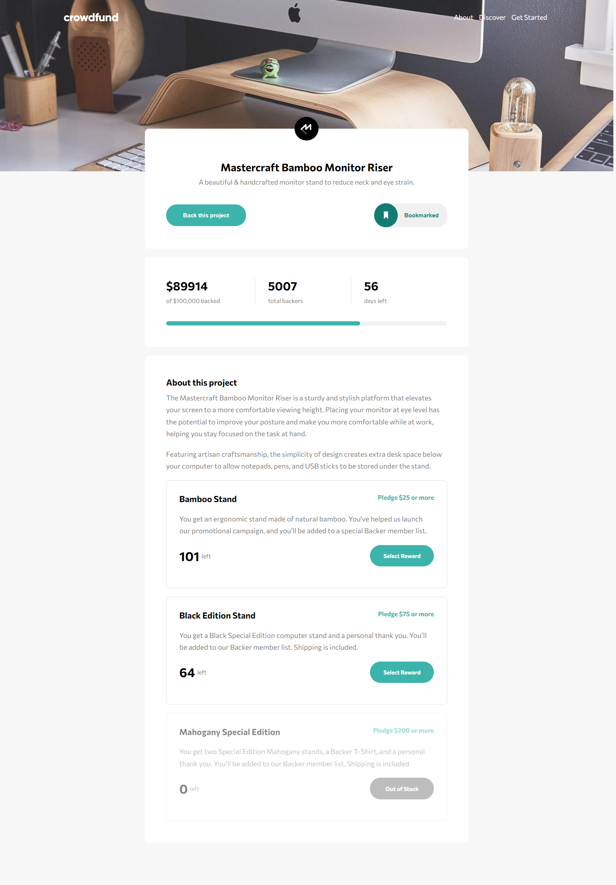

# CrowdFunding Project

## Table of contents

- [Overview](#overview)
  - [Screenshot](#screenshot)
  - [Links](#links)
- [My process](#my-process)
  - [Built with](#built-with)
  - [What I learned](#what-i-learned)
- [Author](#author)

## Overview

### Screenshot

### Links

- Live Site URL: [Link to live site]()

### Built with

- Semantic HTML5 markup
- CSS custom properties
- Grid
- Flex 
- ClassList

### What I learned

There are so many advance properties that i learnt from things this project

- Higher Order Array Methods

## Author

- Frontend Mentor - [@z3shan7](https://www.frontendmentor.io/profile/z3shan7)
